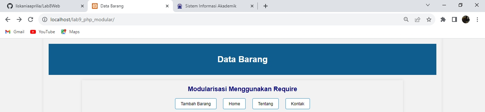
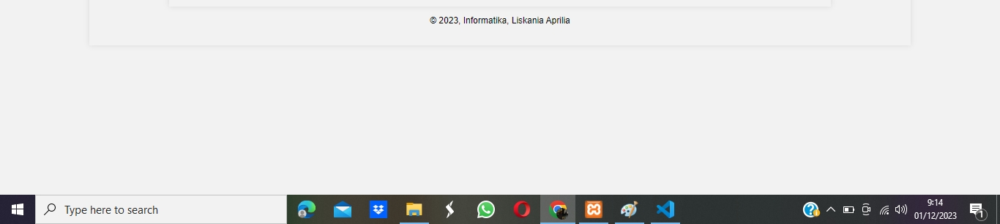
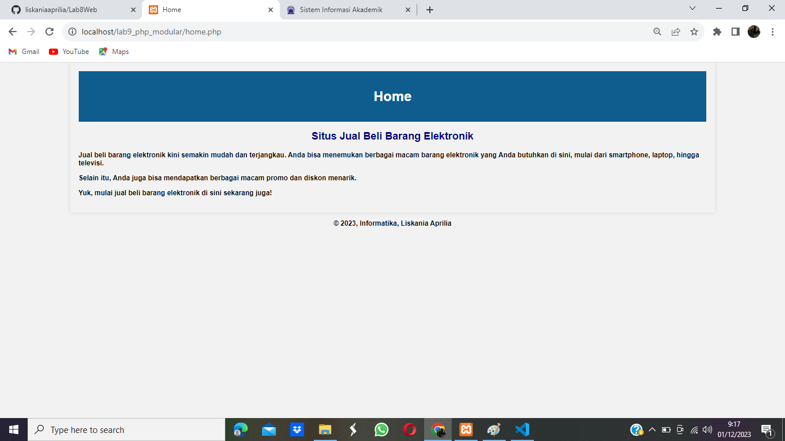
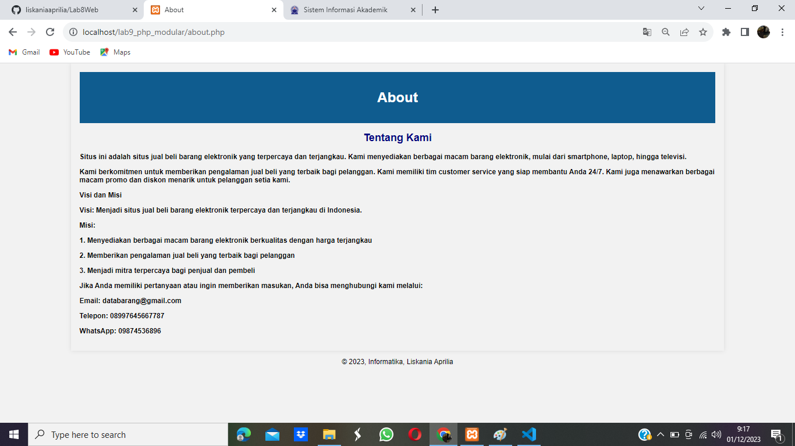
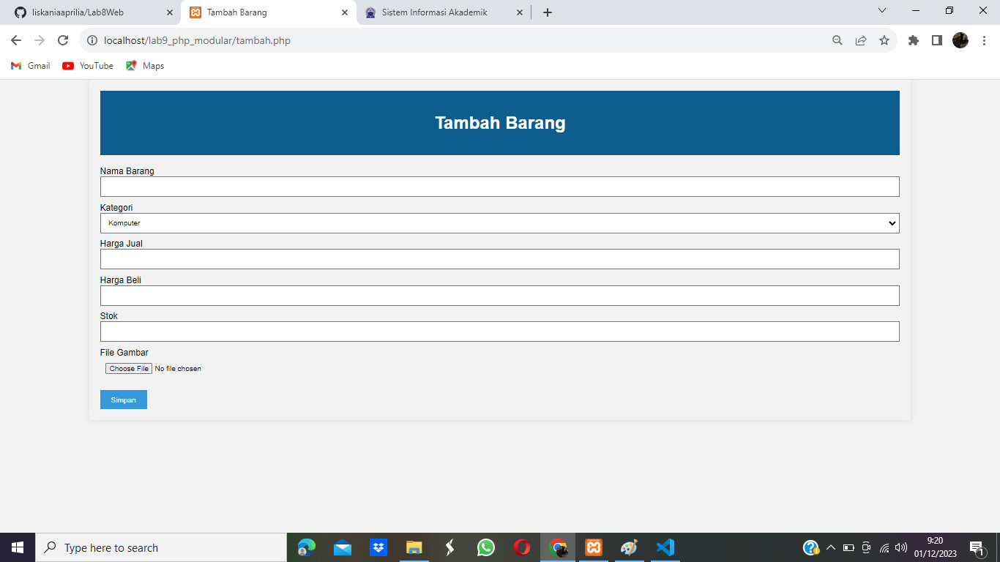
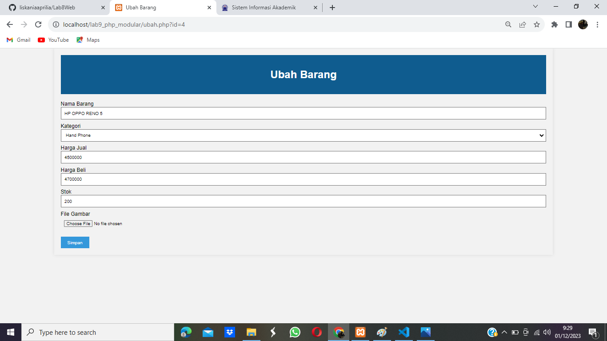
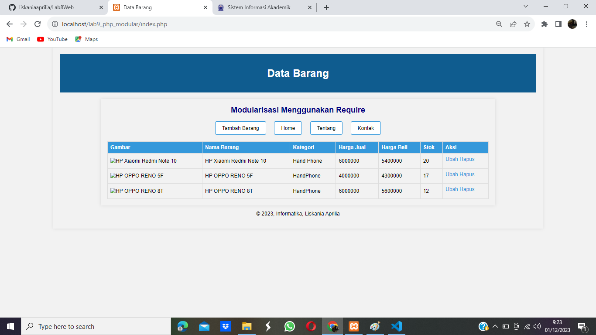

# PHP MODULAR

PHP modular adalah sebuah pendekatan dalam pengembangan aplikasi PHP dengan cara membagi aplikasi menjadi beberapa modul yang lebih kecil dan mandiri. Modul-modul ini dapat dikembangkan dan diuji secara terpisah, sehingga memudahkan proses pengembangan dan pemeliharaan aplikasi.

## Instruksi Praktikum
1. Persiapkan text editor misalnya VSCode. 
2. Buat folder baru dengan nama lab9_php_modular pada docroot webserver
(htdocs)
3. Ikuti langkah-langkah praktikum yang akan dijelaskan berikutnya.

## Langkah-Langkah Praktikum

### 1. Buat file baru dengan nama header.php

```PHP
<?php
include("koneksi.php");

// query untuk menampilkan data
$sql = 'SELECT * FROM data_barang';
$result = mysqli_query($conn, $sql);

?>

<!DOCTYPE html>
<html lang="en">
<head>
    <meta charset="UTF-8">
    <title>Contoh Modularisasi</title>
    <link href="style.css" rel="stylesheet" type="text/stylesheet" media="screen" />
</head>
<body>
        <div class="container">
        <header>
        <center>
            <h2 style="color: #000080;">Modularisasi Menggunakan Require</h2>
        </center>
        </header>
        <nav>
            <a href="tambah.php">Tambah Barang</a>
            <a href="home.php">Home</a>
            <a href="about.php">Tentang</a>
            <a href="kontak.php">Kontak</a>
        </nav>
```

### Tampilan Akhir



### 2. Buat file baru dengan nama footer.php

```PHP
        <footer>
            <center>
            <p>&copy; 2023, Informatika, Liskania Aprilia</p>
    </center>
        </footer>
    </div>
</body>
</html>
```

### Tampilan Akhir



### 3. Buat file baru dengan nama home.php

```PHP
<!DOCTYPE html>
<html lang="en">
<head>
    <meta charset="UTF-8">
    <meta http-equiv="X-UA-Compatible" content="IE=edge">
    <meta name="viewport" content="width=device-width, initial-scale=1.0">
    <title>Home</title>
    <link href="style.css" rel="stylesheet" type="text/css" />
</head>
<div class="container">
<div class="title-container">
            <h1 style="color: #FFFFFF;">Home</h1>
        </div>
<div class="content">
    <center>
    <h2 style="color: #000080;">Situs Jual Beli Barang Elektronik</h2>
</center>
</div>
        <b>
    <p>Jual beli barang elektronik kini semakin mudah dan terjangkau. Anda bisa menemukan berbagai macam barang elektronik yang Anda butuhkan di sini, mulai dari smartphone, laptop, hingga televisi.</p>

<p>Selain itu, Anda juga bisa mendapatkan berbagai macam promo dan diskon menarik.</p>

<p>Yuk, mulai jual beli barang elektronik di sini sekarang juga!</p>
<b>
</div>
<?php require('footer.php'); ?>
</html>
```

### Tampilan Akhir



### 4. Buat file baru dengan nama about.php

```PHP
<!DOCTYPE html>
<html lang="en">
<head>
    <meta charset="UTF-8">
    <meta http-equiv="X-UA-Compatible" content="IE=edge">
    <meta name="viewport" content="width=device-width, initial-scale=1.0">
    <title>About</title>
    <link href="style.css" rel="stylesheet" type="text/css" />
</head>
<div class="container">
<div class="title-container">
            <h1 style="color: #FFFFFF;">About</h1>
        </div>
<div class="content">
    <center>
    <h2 style="color: #000080;">Tentang Kami</h2>
</center>
</div>
        <b>

<p>Situs ini adalah situs jual beli barang elektronik yang terpercaya dan terjangkau. Kami menyediakan berbagai macam barang elektronik, mulai dari smartphone, laptop, hingga televisi.</p>

<p>Kami berkomitmen untuk memberikan pengalaman jual beli yang terbaik bagi pelanggan. Kami memiliki tim customer service yang siap membantu Anda 24/7. Kami juga menawarkan berbagai macam promo dan diskon menarik untuk pelanggan setia kami.</p>

<p>Visi dan Misi</p>

<p>Visi: Menjadi situs jual beli barang elektronik terpercaya dan terjangkau di Indonesia.</p>

<p>Misi:</p>

<p>1. Menyediakan berbagai macam barang elektronik berkualitas dengan harga terjangkau</p>
<p>2. Memberikan pengalaman jual beli yang terbaik bagi pelanggan</p>
<p>3. Menjadi mitra terpercaya bagi penjual dan pembeli</p>


<p>Jika Anda memiliki pertanyaan atau ingin memberikan masukan, Anda bisa menghubungi kami melalui:</p>

<p>Email: databarang@gmail.com</p>
<p>Telepon: 08997645667787</p>
<p>WhatsApp: 09874536896</p>
              
</b>
</div>
<?php require('footer.php'); ?>
</html>
```

### Tampilan Akhir



# PERTANYAAN & TUGAS

Implementasikan konsep modularisasi pada kode program praktikum 8 tentang database, sehingga setiap halamannya memiliki template tampilan yang sama.

### 1. Membuat file index untuk menampilkan data (Read)


### 2. Menambah Data (Create)



.png)

### 3. Mengubah Data (Update)



.png)

### 4. Menghapus Data (Delete)



# FINISH